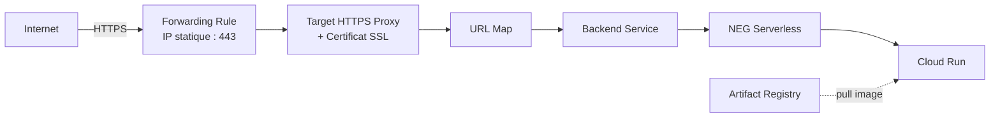
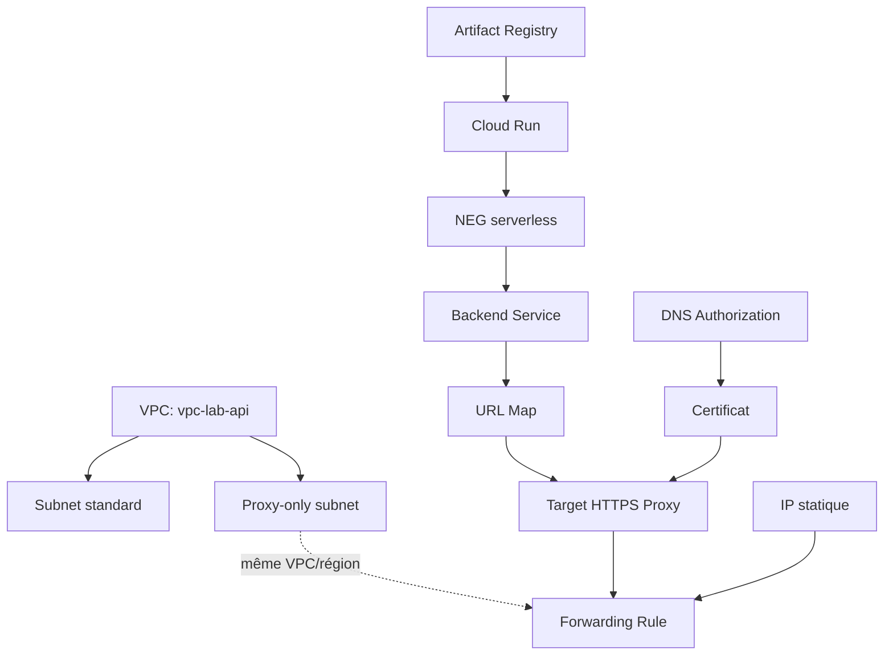

# GCP — Cloud Run derrière un Load Balancer HTTPS régional externe

Architecture : exposer une API conteneurisée derrière un Load Balancer HTTPS régional externe, avec domaine personnalisé et certificat SSL auto-managé (Certificate Manager).

## Architecture



## Prérequis

- Projet GCP avec billing actif
- `gcloud` CLI configuré (`gcloud config set project PROJECT_ID`)
- Domaine avec accès à la gestion DNS (registrar externe ou Cloud DNS)
- APIs activées :

```bash
gcloud services enable \
  run.googleapis.com \
  artifactregistry.googleapis.com \
  compute.googleapis.com \
  cloudbuild.googleapis.com \
  certificatemanager.googleapis.com
```

## Variables utilisées dans ce guide

```bash
# Récupérer l'ID de ton projet GCP :
#   gcloud config get-value project
# ou depuis la console : https://console.cloud.google.com → sélecteur de projet (en haut à gauche)

PROJECT_ID=YOUR_PROJECT_ID
REGION=europe-west1
DOMAIN=YOUR_DOMAIN
REPO=lab-registry
IMAGE=api-simple
```

---

## 1. VPC et Subnets

```bash
gcloud compute networks create vpc-lab-api \
  --subnet-mode=custom
```

```bash
gcloud compute networks subnets create subnet-lab-api \
  --network=vpc-lab-api \
  --region=europe-west1 \
  --range=10.20.0.0/24
```

### Proxy-only subnet (requis pour tout LB régional Envoy-based)

```bash
gcloud compute networks subnets create proxy-only-subnet-lab \
  --purpose=REGIONAL_MANAGED_PROXY \
  --role=ACTIVE \
  --region=europe-west1 \
  --network=vpc-lab-api \
  --range=10.21.0.0/24
```

> Requis une seule fois par région/VPC, pas une fois par Load Balancer.

---

## 2. Build et push de l'image (Cloud Build)

### Service account dédié (least privilege)

```bash
gcloud iam service-accounts create cloudbuild-lab-sa \
  --display-name="Cloud Build SA - Lab LB+CloudRun" \
  --project=YOUR_PROJECT_ID
```

```bash
gcloud projects add-iam-policy-binding YOUR_PROJECT_ID \
  --member="serviceAccount:cloudbuild-lab-sa@YOUR_PROJECT_ID.iam.gserviceaccount.com" \
  --role="roles/storage.objectViewer"

gcloud projects add-iam-policy-binding YOUR_PROJECT_ID \
  --member="serviceAccount:cloudbuild-lab-sa@YOUR_PROJECT_ID.iam.gserviceaccount.com" \
  --role="roles/artifactregistry.writer"

gcloud projects add-iam-policy-binding YOUR_PROJECT_ID \
  --member="serviceAccount:cloudbuild-lab-sa@YOUR_PROJECT_ID.iam.gserviceaccount.com" \
  --role="roles/logging.logWriter"
```

### `cloudbuild.yaml`

```yaml
steps:
  - name: 'gcr.io/cloud-builders/docker'
    args: ['build', '-t', 'europe-west1-docker.pkg.dev/YOUR_PROJECT_ID/lab-registry/api-simple:v1', '.']
images:
  - 'europe-west1-docker.pkg.dev/YOUR_PROJECT_ID/lab-registry/api-simple:v1'
options:
  logging: CLOUD_LOGGING_ONLY
```

### Build

```bash
gcloud builds submit \
  --config=cloudbuild.yaml \
  --service-account="projects/YOUR_PROJECT_ID/serviceAccounts/cloudbuild-lab-sa@YOUR_PROJECT_ID.iam.gserviceaccount.com" \
  .
```

---

## 3. Déploiement Cloud Run

```bash
gcloud run deploy api-simple \
  --image=europe-west1-docker.pkg.dev/YOUR_PROJECT_ID/lab-registry/api-simple:v1 \
  --region=europe-west1 \
  --platform=managed \
  --no-allow-unauthenticated \
  --port=8080
```

### Restreindre l'ingress au Load Balancer uniquement

```bash
gcloud run services update api-simple \
  --region=europe-west1 \
  --ingress=internal-and-cloud-load-balancing
```

### Autoriser l'invocation (sécurisé par l'ingress ci-dessus)

```bash
gcloud run services add-iam-policy-binding api-simple \
  --region=europe-west1 \
  --member="allUsers" \
  --role="roles/run.invoker"
```

---

## 4. NEG serverless

```bash
gcloud compute network-endpoint-groups create neg-api-simple \
  --region=europe-west1 \
  --network-endpoint-type=serverless \
  --cloud-run-service=api-simple
```

---

## 5. Backend Service

```bash
gcloud compute backend-services create backend-api-simple \
  --load-balancing-scheme=EXTERNAL_MANAGED \
  --protocol=HTTPS \
  --region=europe-west1
```

```bash
gcloud compute backend-services add-backend backend-api-simple \
  --region=europe-west1 \
  --network-endpoint-group=neg-api-simple \
  --network-endpoint-group-region=europe-west1
```

---

## 6. Certificat SSL (Certificate Manager — régional)

> Les certificats Google-managés "classiques" (`compute ssl-certificates`) ne supportent pas les LB régionaux. Utiliser Certificate Manager.

### DNS Authorization

```bash
gcloud certificate-manager dns-authorizations create dns-auth-lab \
  --domain="YOUR_DOMAIN" \
  --location=europe-west1
```

### Récupérer le CNAME de validation

```bash
gcloud certificate-manager dns-authorizations describe dns-auth-lab \
  --location=europe-west1 \
  --format="yaml(dnsResourceRecord)"
```

### Enregistrements DNS à créer chez le registrar

| Type | Nom | Valeur |
|---|---|---|
| A | `<subdomain>` | `<IP_STATIQUE>` |
| CNAME | `_acme-challenge_xxx.<subdomain>` | `<valeur retournée ci-dessus>` |

### Vérifier la propagation DNS

```bash
dig YOUR_DOMAIN A +short
dig _acme-challenge_xxx.YOUR_DOMAIN CNAME +short
```

### Créer le certificat

```bash
gcloud certificate-manager certificates create cert-lab-api \
  --domains="YOUR_DOMAIN" \
  --dns-authorizations=dns-auth-lab \
  --location=europe-west1
```

### Suivre le provisioning

```bash
gcloud certificate-manager certificates describe cert-lab-api \
  --location=europe-west1 \
  --format="yaml(managed.state, managed.provisioningIssue)"
```

> `PROVISIONING` → `ACTIVE` : peut prendre de 15 min à plusieurs heures après propagation DNS. Renouvellement automatique ensuite, tant que le CNAME reste en place.

---

## 7. Target HTTPS Proxy

```bash
gcloud compute target-https-proxies create proxy-lab-api \
  --url-map=url-map-lab-api \
  --certificate-manager-certificates=cert-lab-api \
  --region=europe-west1
```

---

## 8. URL Map

```bash
gcloud compute url-maps create url-map-lab-api \
  --default-service=backend-api-simple \
  --region=europe-west1
```

---

## 9. IP statique et Forwarding Rule

```bash
gcloud compute addresses create ip-lab-api \
  --region=europe-west1
```

```bash
gcloud compute addresses describe ip-lab-api \
  --region=europe-west1 \
  --format="get(address)"
```

```bash
gcloud compute forwarding-rules create fr-lab-api \
  --load-balancing-scheme=EXTERNAL_MANAGED \
  --network-tier=PREMIUM \
  --address=ip-lab-api \
  --target-https-proxy=proxy-lab-api \
  --target-https-proxy-region=europe-west1 \
  --region=europe-west1 \
  --network=vpc-lab-api \
  --ports=443
```

> `--network-tier` doit correspondre au tier de l'IP réservée (PREMIUM par défaut).
> `--network` doit être le VPC contenant le proxy-only subnet.

---

## 10. Test

```bash
curl -v https://YOUR_DOMAIN
```

---

## Schéma de dépendances



---

## Nettoyage (ordre inverse de création)

```bash
gcloud compute forwarding-rules delete fr-lab-api --region=europe-west1 --quiet
gcloud compute addresses delete ip-lab-api --region=europe-west1 --quiet
gcloud compute target-https-proxies delete proxy-lab-api --region=europe-west1 --quiet
gcloud certificate-manager certificates delete cert-lab-api --location=europe-west1 --quiet
gcloud certificate-manager dns-authorizations delete dns-auth-lab --location=europe-west1 --quiet
gcloud compute url-maps delete url-map-lab-api --region=europe-west1 --quiet
gcloud compute backend-services delete backend-api-simple --region=europe-west1 --quiet
gcloud compute network-endpoint-groups delete neg-api-simple --region=europe-west1 --quiet
gcloud run services delete api-simple --region=europe-west1 --quiet
gcloud compute networks subnets delete proxy-only-subnet-lab --region=europe-west1 --quiet
gcloud compute networks subnets delete subnet-lab-api --region=europe-west1 --quiet
gcloud compute networks delete vpc-lab-api --quiet
```

Penser à supprimer manuellement les enregistrements DNS (A + CNAME) chez le registrar, et optionnellement l'image dans Artifact Registry et le service account `cloudbuild-lab-sa`.

---

## Pièges rencontrés

| Erreur | Cause | Solution |
|---|---|---|
| `An active proxy-only subnetwork is required...` | Pas de proxy-only subnet dans le VPC/région | Créer le subnet avec `--purpose=REGIONAL_MANAGED_PROXY` |
| `The network tier of specified IP address is PREMIUM...` | Tier de l'IP ≠ tier du forwarding-rule | Aligner `--network-tier` sur les deux ressources |
| Certificat global incompatible avec LB régional | `compute ssl-certificates` crée uniquement des certificats globaux | Utiliser Certificate Manager pour un certificat régional |

---

## Licence

MIT
